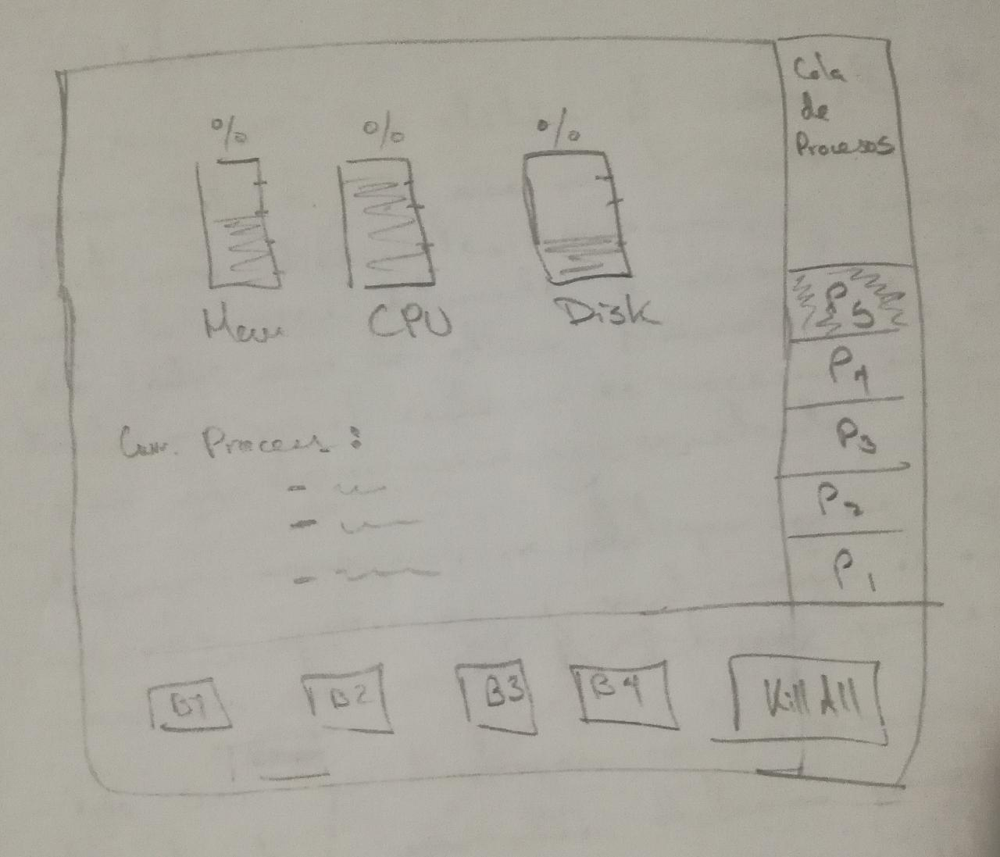

<div style="display: inline-block; margin-left: 100px">  </div>

<div style="display: inline-block; margin-left: 300px"> </div>

# <center>Práctica 01: Administrador de Tareas</center>


## Uso
<p>Los siquientes elementos son necesarios para la ejecución del código</p>

+ Python 3.7.x
+ [Miniconda](https://docs.conda.io/en/latest/miniconda.html)
+ PyQt 5
+ Qt Designer

### Instalar PyQt 5 y Qt Designer

```
conda update --all
conda install qt
conda install pyqt
```

### Iniciar el editor Qt

En el terminal ejecutar `designer` y abrir el archivo AdministradorDeTareas.ui

### Convertir cambios a Python

Para que los cambios en el editor de interfaces surta efecto, es necesario ejecutar el siguiente comando que transformara el archivo `.ui` en un archivo `.py`

```
pyuic5 -x AdministradorDeTareas.ui -o AdministradorDeTareas_UI.py
```

### Cambios de funcionalidades

Para agregar funcionalidades en el programa es necesario trabajar sobre el archivo `AdministradorDeTareas.py` en la clase `MainWindow`

### Ejecutar programa

Para la ejecución del programa se debe hacer en la shell el siguiente comando

```
python AdministradorDeTareas.py
```


## Dependecias
+ [PyQt5](https://www.riverbankcomputing.com/static/Docs/PyQt5/)
+ [Psutil](https://anaconda.org/anaconda/psutil)

## Sketch


## Licencia
[MIT](https://choosealicense.com/licenses/mit/)